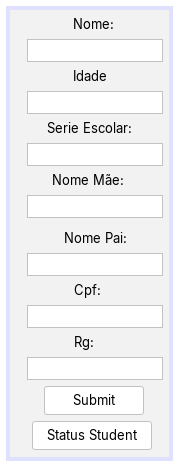
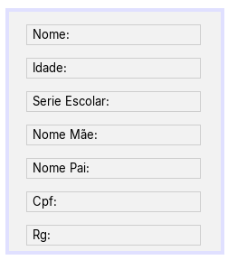

# Project School with interafce

> ## Descrição:
> Esse Projeto cria um Student dentro do Sistema da Escola e mostra os seus Status,
> a parte de Criar o Student e ver os seus status estão em interface.
> 	As interfaces foi Contruidas com a Biblioteca do Java.Swing do próprio java,
> a criação da interface eu fiz Usando o ***Net Breans***  muito usado para a criação
> de interface para Desktop
> 	Eu fiz Esse Projeto para testar os meus Conhecimento de criação de interface 
> 	para **Desktop** eu usei a mesma logica de criação de codigo do meu outro projeto
> 	[SoftwareSchool](https://github.com/GoomezCode/SoftwareSchool) que está no meu **GitHub**
> ## Liguagem Usada:
>
>
> ---

## Ajustes e Melhorias
O projeto está em sempre constante atualizações que está voltada as **Tarefas** e as proximas tarefas serão :
- [X] Contrução da Lógica do projeto
- [ ] Construção da interface (totalmente dinâmica)
- [ ] Contrução do banco de Dados (Para a criação de **Cadastro** e **Login** ) 
- [ ] Transferir isso para uma Página Web e Desktop (totalmente funcional)
- [ ] Adicionar temas **white** e **dark**
- [ ] Documentar o projeto totalmente **English** 
- [ ] Adicionar **HTML**, **CSS** e **JavaScript** para um frontEnd
- [ ] Irei Escrever os usuários dos **admins**(Gerenciar Salario, Faltas, batePontos e etc..) e funcionarios(professores, estágiario, Limpeza )

>***
>
> ## Apresentação das Interfaces do Aluno:  
> Adicionar os dados de um Aluno | Status de todos os dados
> :--: | :--:  
>  | 
> 
>***

>***
>
>## Lincença:
>Este projeto está sob a licença MIT. Veja o arquivo **[LICENSE](LICENSE.txt)** para mais detalhes.
>## **Autor:**
>Feito Por **[GoomezCode](https://github.com/GoomezCode)**
>Email para Contato @danielgdpaula@gmail.com
>
>***

